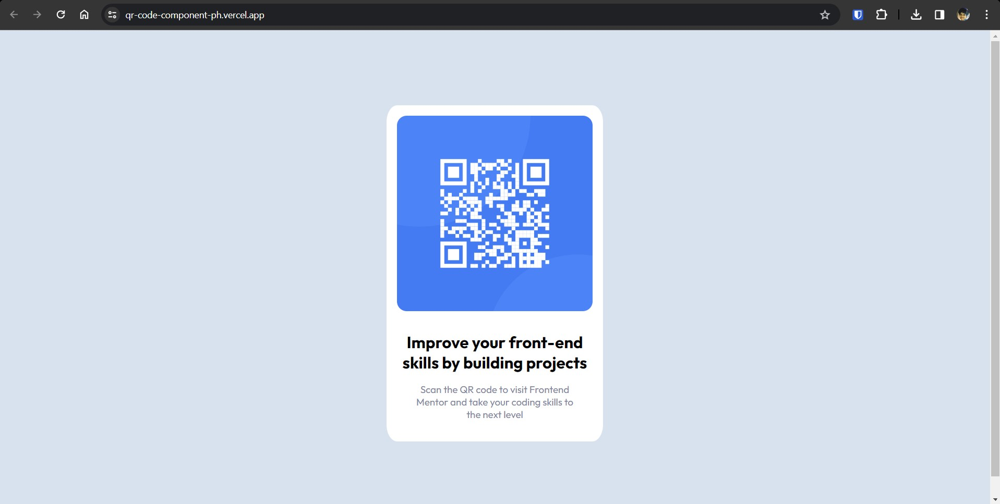

# Frontend Mentor - QR code component solution

This is a solution to the [QR code component challenge on Frontend Mentor](https://www.frontendmentor.io/challenges/qr-code-component-iux_sIO_H).

## Table of contents

- [Overview](#overview)
  - [Screenshot](#screenshot)
  - [Links](#links)
- [My process](#my-process)
  - [Built with](#built-with)
  - [What I learned](#what-i-learned)
- [Author](#author)

## Overview

### Screenshot

### Links

- Solution URL: [GitHub Repo](https://github.com/Prithwish-Hati/qr-code-component)
- Live Site URL: [Vercel Deployment](https://qr-code-component-ph.vercel.app)

## My process

### Built with

- Semantic HTML5 markup
- CSS custom properties
- Flexbox

### What I learned

1. **Inline-Block Elements:**

   - Utilized the `display: inline-block;` property for elements within the `#container p > span` selector, allowing them to align horizontally while maintaining block-level styling.

2. **HSL Colors:**

   - Applied HSL (Hue, Saturation, Lightness) color representation for background and text colors using the `hsl()` function, such as `hsl(212, 45%, 89%)` and `hsl(220, 15%, 55%)`.

3. **Combining CSS Selectors:**
   - Employed combined selectors like `#container p > span` to target specific nested elements, allowing fine-grained control over styling based on the document structure.

## Author

- Website - [Prithwish Hati](https://prithwish.vercel.app)
- Frontend Mentor - [@Prithwish-Hati](https://www.frontendmentor.io/profile/Prithwish-Hati)
- Twitter - [@PrithwishHati](https://twitter.com/PrithwishHati)
